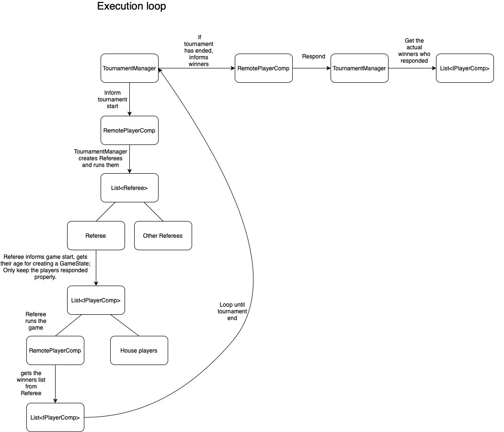

## Remote Collaboration Protocol
For the logical interaction diagram of the remote collaboration protocol, see the diagram below. 
  
 
Further diagrams providing greater detail of what each interaction consists of can be found in
 this diagram. 
 
## Explanation of Protocol in Prose

In order to handle communications between the Fish.com game server and a remote client, a new
 component will be necessary. It will be called RemotePlayerComponent, and it will implement the
  IPlayerComponent interface in order to be able to be used in the previously written code
   without needing to rewrite TournamentManager and Referee code around it. It will handle
    sending and receiving of JSON messages to and from the external player, as well as the
     serialization and deserialization of these JSON messages. The format of the JSON messages to
      be sent to and from RemotePlayerComponent objects is specified later in this protocol. 

The interactions and format of communications between the Fish.com game server and a remote
 client and their respective components are described in the following protocol. 
 
#### Tournament Initialization
A tournament manager is passed a list of IPlayerComponent objects, which is assumed to already
 be in age-sorted order, the list having been made in a sorted order by the signup layer. The
  signup layer should have given the tournament manager a list of some combination of
   RemotePlayerComponent objects (each handling communications with a single external client) and
    internal house players, which will have different variants with differing game
    -playing strategies. Given this list of player components, the tournament manager should
     inform all players of the tournament's beginning (eliminating all players that fail to
      acknowledge it). The format of the message sent to remote clients will be in JSON,
       specifically as a string with the message "Tournament has started." The message that the 
       external players should return to their RemotePlayerComponent should be another JSON string, 
       "Acknowledge tournament start.".
         
#### Referee Game Generation
After this initialization, Referees are passed subsets of the list of active players for games
 that they will manage. Referees begin by requesting the age from the player component (this may
  change later; age might be assigned internally and represent order in which component connected
   to the system instead of literal age), which requires messages to be sent to clients. Requests
    for age will be sent as a JSON string saying "Request age." to remote players from the
     RemotePlayerComponent, and the RemotePlayerComponent will await a natural number response
      in JSON from the client. Again, failures to respond and invalid responses result in the
       elimination of a player.
       
#### Referee Game Running
After these Referees are generated, the games of the Referees are run. This involves informing
 players in the game they have begun playing with informational JSON messages sent to them. The
  format of these messages will be "Game has started.", and a response of "Acknowledge game
   start." is expected from the external player. Invalid/failing responses are eliminated. The
    referee then runs its game, which requires sending requests for penguin placements and
     penguin movements during the game. External players are responsible for understanding when
      the placing phase has switched to the playing phase. Requests for placements/movements will
       be sent as a JSON State, as defined in the testing task of milestone 4, with the expected
        response being a JSON Position (as defined in testing task, m3) for placements or
         a JSON Action (testing task, m5) for movements. This continues until the game ends, at
          which point a message "Game has ended." is sent to player components, with an expected
           response of "Acknowledge game end.". 
           
#### Tournament Continuation/Completion
Lastly, once the referees have completed their games, a tournament round is complete, and the
 tournament manager checks for tournament-end conditions. If it's not over, it runs another round. 
  If the tournament is over, the manager notifies all players that the tournament has ended, with
   a JSON message saying "Tournament has ended.", expecting a response of "Acknowledge tournament
    end.". Failure to respond or incorrect responses result in elimination from the game (and the
     winners list). This last message received from external players marks the end of
      communications for a given tournament.